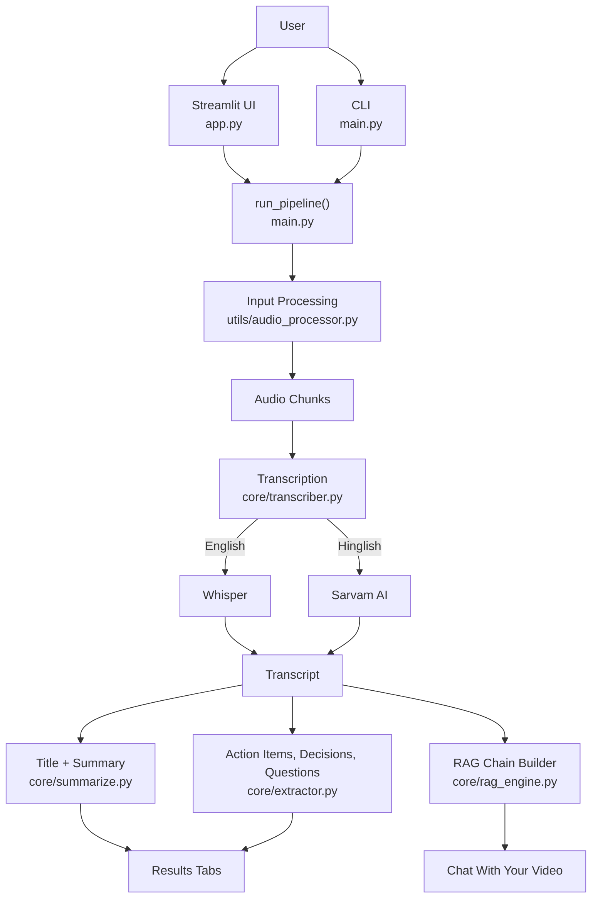
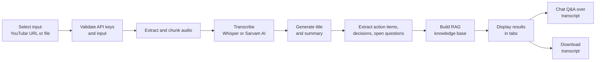
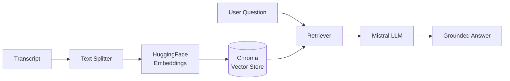

<div align="center">

# 🎥 AI Video Assistant

**Turn videos and meeting recordings into transcripts, summaries, action items, decisions, and a chat-ready knowledge base, powered by Whisper, LangChain, and Mistral AI.**

[](https://github.com/harshantla-cloud/AI-VIDEO-ASSISTANT)
[](https://www.python.org/)
[](https://streamlit.io/)
[](https://www.langchain.com/)
[](https://mistral.ai/)
[](#-ai--rag-pipeline)

</div>

---

**AI Video Assistant** is a Streamlit application and CLI that converts YouTube videos or local audio/video files into structured meeting intelligence. It transcribes speech (English via Whisper, Hinglish via Sarvam AI), uses a Mistral-based LLM to produce a title, summary, action items, key decisions, and open questions, and indexes the transcript in a vector store so users can ask natural-language questions about the content. It is built for teams, students, and professionals who need to extract value from long recordings without watching them end to end.

---

## 🚀 Project Overview

| | |
|---|---|
| **Problem** | Meetings, lectures, and long-form videos contain decisions and tasks that are time-consuming to find and easy to miss. |
| **Solution** | An automated pipeline that transcribes the audio, extracts structured insights with an LLM, and exposes the transcript through a retrieval-augmented (RAG) chat interface. |
| **Target Users** | Teams reviewing meeting recordings, students working through lecture videos, and anyone summarizing YouTube or local media. |
| **Use Case** | Paste a YouTube URL or upload a recording → receive a summary, action items, decisions, and open questions → ask follow-up questions grounded in the transcript. |
| **Key Value** | Replaces manual note-taking and re-watching with a single-click analysis and a conversational interface over the source content. |

---

## 🎯 Objectives

- Automate transcription of YouTube videos and local audio/video files
- Support both English and Hinglish transcription modes
- Generate a concise title and summary from the transcript
- Extract action items, key decisions, and unresolved questions
- Enable question answering over the transcript using retrieval-augmented generation
- Provide both a web interface (Streamlit) and a command-line interface

---

## ✨ Key Features

### Core Features
- **Two input modes:** YouTube URL or local file upload (`mp4`, `mkv`, `mov`, `avi`, `mp3`, `wav`, `m4a`, `webm`)
- **Bilingual transcription:** English (Whisper) and Hinglish (Sarvam AI)
- **Structured outputs:** title, summary, action items, key decisions, open questions, and full transcript
- **Transcript export** as a `.txt` file

### ML/AI Features
- **LLM-powered analysis** via Mistral AI through LangChain
- **RAG-based Q&A:** the transcript is indexed in a vector database and queried by a retrieval chain
- **Local speech recognition** with OpenAI Whisper

### User Interface Features
- Streamlit UI with a sidebar for input type and transcription mode
- Live API-key status indicators (Mistral, and Sarvam when Hinglish is selected)
- Tabbed results view: Summary · Action Items · Decisions · Open Questions · Transcript
- Chat interface with per-session history
- Step-by-step progress status while the pipeline runs

### Engineering Features
- Modular layout separating UI, orchestration, core AI logic, and audio utilities
- Environment-based secret management with `python-dotenv` and a `.env.example` template
- Input validation and API-key checks before processing starts
- Temporary uploaded files are cleaned up after processing
- Graceful error handling with expandable technical details in the UI

---

## 🏗️ System Architecture



**Components**

| Component | Responsibility |
|---|---|
| `app.py` | Streamlit front end: input selection, validation, progress display, tabbed results, transcript download, RAG chat |
| `main.py` | `run_pipeline()` orchestrates the full flow; also provides an interactive CLI with a chat loop |
| `utils/audio_processor.py` | `process_input()` prepares the YouTube URL or local file into audio chunks |
| `core/transcriber.py` | `transcribe_all()` converts chunks into a single transcript for the selected language mode |
| `core/summarize.py` | `generate_title()` and `summarize()` |
| `core/extractor.py` | `extract_action_items()`, `extract_key_decisions()`, `extract_questions()` |
| `core/rag_engine.py` | `build_rag_chain()` indexes the transcript; `ask_question()` answers queries against it |

---

## 🔄 Project Workflow



---

## 🧠 AI / RAG Pipeline

This project orchestrates **pretrained and hosted models**; it does not train or fine-tune any model, so there is no dataset, target variable, train/test split, or model-selection step.

| Stage | Implementation |
|---|---|
| 1. Input | YouTube URL (via `yt-dlp`) or uploaded audio/video file |
| 2. Audio processing | Audio extraction and chunking (`pydub`, `ffmpeg-python`) |
| 3. Speech-to-text | Whisper (English) / Sarvam AI (Hinglish) |
| 4. Text analysis | Mistral LLM via `langchain-mistralai`: title, summary, action items, decisions, open questions |
| 5. Indexing | Transcript split with `langchain-text-splitters`, embedded with HuggingFace embeddings, stored in Chroma |
| 6. Retrieval + generation | LangChain retrieval chain answers user questions from the indexed transcript |
| Chunk size / overlap | Not specified |
| Retriever settings (top-k) | Not specified |



---

## 🤖 Models Used

| Model / Service | Purpose | Evaluation Metric | Result |
|---|---|---|---|
| OpenAI Whisper | English speech-to-text | Not specified | Not specified |
| Sarvam AI | Hinglish speech-to-text | Not specified | Not specified |
| Mistral AI (via LangChain) | Summarization, extraction, RAG answer generation | Not specified | Not specified |
| HuggingFace sentence-transformers | Transcript embeddings for retrieval | Not specified | Not specified |

> No benchmark scores are reported in the repository, so none are listed here. Specific model variants (e.g., Whisper size, Mistral model name, embedding model) are **Not specified** in this documentation.

---

## 🖥️ Application Preview

The Streamlit interface includes:

- **Hero header and sidebar:** input type (YouTube URL / Local Video or Audio), transcription mode (English — Whisper / Hinglish — Sarvam AI), and API status indicators
- **Analysis view:** meeting title plus five tabs: Summary, Action Items, Decisions, Open Questions, Transcript
- **Chat panel:** conversational Q&A over the analyzed transcript

<!--
Add real screenshots here once they are committed to the repo, e.g.:

### Home / Input Interface


### Analysis Results


### Chat With Your Video

-->

---

## 📈 Results

The pipeline returns a single structured result object:

| Output | Description |
|---|---|
| `title` | Auto-generated title for the video |
| `summary` | Meeting/video summary |
| `action_items` | Extracted tasks |
| `key_decisions` | Decisions identified in the discussion |
| `open_questions` | Unresolved questions |
| `transcript` | Full transcript (downloadable as `.txt`) |
| `rag_chain` | Retrieval chain used by the chat interface |

No quantitative evaluation (e.g., WER for transcription, or answer-quality metrics for RAG) is included in the repository.

---

## 🛠️ Tech Stack

| Category | Technology |
|---|---|
| Language | Python |
| Frontend | Streamlit |
| Speech Recognition | OpenAI Whisper (`openai-whisper`, `torch`, `torchaudio`), Sarvam AI |
| LLM | Mistral AI (`mistralai`, `langchain-mistralai`) |
| Orchestration | LangChain (`langchain`, `langchain-core`, `langchain-community`, `langchain-text-splitters`) |
| Vector Database | ChromaDB (`chromadb`, `langchain-chroma`) |
| Embeddings | HuggingFace (`langchain-huggingface`, `sentence-transformers`, `transformers`) |
| Media Handling | `yt-dlp`, `pydub`, `ffmpeg-python` |
| Utilities | `python-dotenv`, `numpy`, `requests`, `deep-translator` |
| Version Control | Git / GitHub |

---

## 📁 Project Structure

```text
AI-VIDEO-ASSISTANT/
│
├── .vscode/               # Editor settings
├── core/                  # Core AI logic
│   ├── transcriber.py     # Speech-to-text (Whisper / Sarvam AI)
│   ├── summarize.py       # Title and summary generation
│   ├── extractor.py       # Action items, decisions, open questions
│   └── rag_engine.py      # RAG chain construction and Q&A
├── utils/
│   └── audio_processor.py # YouTube / local file → audio chunks
├── app.py                 # Streamlit web application
├── main.py                # Pipeline orchestration + CLI entry point
├── requirements.txt       # Python dependencies
├── .env.example           # Environment variable template
└── .gitignore
```

---

## ⚙️ Installation & Setup

### Prerequisites
- Python 3.x (exact version not specified)
- [FFmpeg](https://ffmpeg.org/download.html) installed and available on your `PATH` (required for audio processing)
- A [Mistral AI](https://console.mistral.ai/) API key
- A Sarvam AI API key (only for Hinglish transcription)

### 1. Clone the Repository

```bash
git clone https://github.com/harshantla-cloud/AI-VIDEO-ASSISTANT.git
cd AI-VIDEO-ASSISTANT
```

### 2. Create a Virtual Environment

```bash
python -m venv venv

# macOS / Linux
source venv/bin/activate

# Windows
venv\Scripts\activate
```

### 3. Install Dependencies

```bash
pip install -r requirements.txt
```

### 4. Configure Environment Variables

```bash
cp .env.example .env
```

Edit `.env`:

```env
MISTRAL_API_KEY=your_mistral_api_key_here
SARVAM_API_KEY=your_sarvam_api_key_here   # required only for Hinglish mode
```

### 5. Run the Application

**Web app (Streamlit)**

```bash
streamlit run app.py
```

**Command line**

```bash
python main.py
```

The CLI prompts for a YouTube URL or file path and a language (`english` / `hinglish`), prints the analysis, then opens an interactive Q&A loop (`exit` to quit).

---

## 👤 Author

**Harsh**, B.Tech Computer Science & Engineering (2023–2027)
Focus: Data Science · Machine Learning · AI · Deep Learning

[](https://github.com/harshantla-cloud)

---

## 📄 License

No license file is currently included in this repository.
