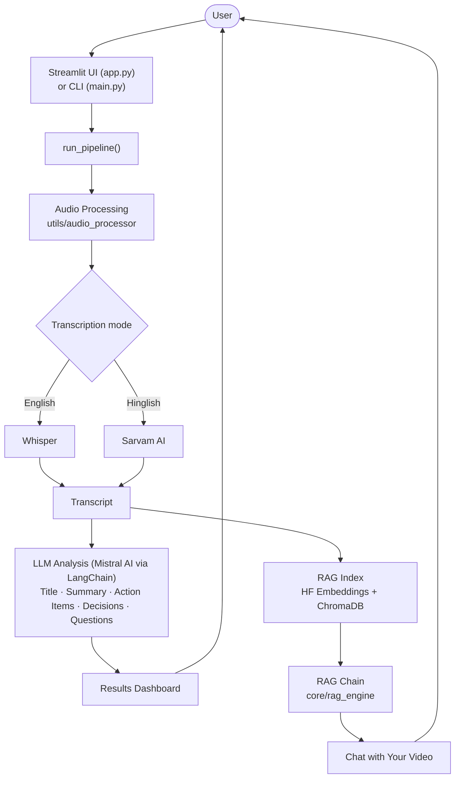
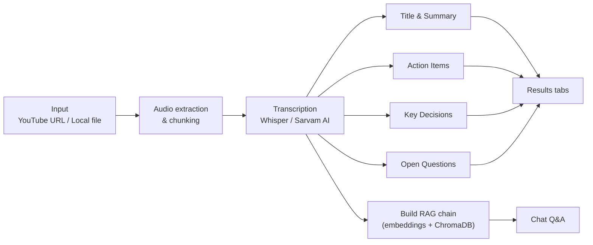
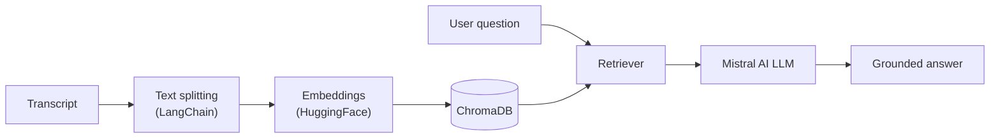

<div align="center">

# 🎥 AI Video Assistant

**Turn videos and meetings into transcripts, structured summaries, action items, and a chat-ready knowledge base — powered by Whisper, LangChain, Mistral AI, and RAG.**

[](https://github.com/harshantla-cloud/AI-VIDEO-ASSISTANT)


</div>

AI Video Assistant is an end-to-end generative AI application that converts YouTube videos and local audio/video recordings into searchable, structured meeting intelligence. It transcribes speech (English via Whisper, Hinglish via Sarvam AI), generates a title, summary, action items, key decisions, and open questions with a Mistral AI LLM, and indexes the transcript in a vector store so users can ask natural-language questions about the content. It is built for professionals and students who need the substance of long recordings without watching them in full.

---

## 🚀 Project Overview

| | |
|---|---|
| **Problem** | Meetings, lectures, and long-form videos contain decisions and tasks that are time-consuming to extract manually. |
| **Solution** | An automated pipeline: audio extraction → transcription → LLM-based analysis → vector indexing → conversational Q&A over the transcript. |
| **Target users** | Teams reviewing meeting recordings, students working through lectures, and anyone who needs fast, queryable summaries of video or audio. |
| **Use case** | Upload a recording or paste a YouTube link, review the generated summary and action items, then ask follow-up questions grounded in the transcript. |
| **Key value** | Converts unstructured spoken content into structured, actionable outputs and a retrieval-based assistant in a single workflow. |

---

## 🎯 Objectives

- Automate transcription of YouTube videos and local audio/video files.
- Support both English and Hinglish (Hindi–English) speech.
- Generate concise meeting summaries and titles with an LLM.
- Extract action items, key decisions, and unresolved questions from transcripts.
- Enable question answering over the transcript using Retrieval-Augmented Generation (RAG).
- Provide both a web interface (Streamlit) and a command-line interface.

---

## ✨ Key Features

### Core Features
- **Multi-source input:** YouTube URL or local file upload (`mp4`, `mkv`, `mov`, `avi`, `mp3`, `wav`, `m4a`, `webm`).
- **Bilingual transcription:** English (Whisper) and Hinglish (Sarvam AI).
- **Structured analysis:** title, summary, action items, key decisions, and open questions.
- **Transcript export:** download the full transcript as a `.txt` file.

### ML / AI Features
- **LLM-powered summarization and extraction** using Mistral AI through LangChain.
- **RAG pipeline:** transcript is embedded (HuggingFace / sentence-transformers) and stored in ChromaDB for semantic retrieval.
- **Conversational Q&A** over the analyzed video via a RAG chain.

### User Interface Features
- Streamlit web app with a sidebar for input type and transcription mode.
- Tabbed results view: Summary, Action Items, Decisions, Open Questions, Transcript.
- Chat interface with per-session conversation history.
- API key status indicators and clear validation/error messages.

### Engineering Features
- Modular structure separating UI (`app.py`), orchestration (`main.py`), AI logic (`core/`), and audio handling (`utils/`).
- Secrets managed through environment variables (`.env`, with `.env.example` provided).
- Shared pipeline function (`run_pipeline`) reused by both the web app and the CLI.
- Temporary uploaded files are cleaned up after processing.

---

## 🏗️ System Architecture


```mermaid
flowchart TD
    U([User]) --> UI["Streamlit UI (app.py)<br/>or CLI (main.py)"]
    UI --> P["run_pipeline()"]
    P --> A["Audio Processing<br/>utils/audio_processor"]
    A --> T{"Transcription mode"}
    T -->|English| W["Whisper"]
    T -->|Hinglish| S["Sarvam AI"]
    W --> TR["Transcript"]
    S --> TR
    TR --> L["LLM Analysis (Mistral AI via LangChain)<br/>Title · Summary · Action Items · Decisions · Questions"]
    TR --> R["RAG Index<br/>HF Embeddings + ChromaDB"]
    L --> OUT["Results Dashboard"]
    R --> Q["RAG Chain<br/>core/rag_engine"]
    Q --> CHAT["Chat with Your Video"]
    OUT --> U
    CHAT --> U
```

**Component overview**

| Component | Responsibility |
|---|---|
| `app.py` | Streamlit interface: input handling, validation, results tabs, chat UI, transcript download. |
| `main.py` | Pipeline orchestration (`run_pipeline`) and a CLI entry point with an interactive Q&A loop. |
| `utils/audio_processor` | Accepts a YouTube URL or local file and prepares audio chunks for transcription. |
| `core/transcriber` | Transcribes audio chunks (Whisper for English, Sarvam AI for Hinglish). |
| `core/summarize` | Generates the title and summary. |
| `core/extractor` | Extracts action items, key decisions, and open questions. |
| `core/rag_engine` | Builds the RAG chain over the transcript and answers questions. |

---

## 🔄 Project Workflow


```mermaid
flowchart LR
    A["Input<br/>YouTube URL / Local file"] --> B["Audio extraction<br/>& chunking"]
    B --> C["Transcription<br/>Whisper / Sarvam AI"]
    C --> D["Title & Summary"]
    C --> E["Action Items"]
    C --> F["Key Decisions"]
    C --> G["Open Questions"]
    C --> H["Build RAG chain<br/>(embeddings + ChromaDB)"]
    D & E & F & G --> I["Results tabs"]
    H --> J["Chat Q&A"]
```

---

## 🧠 AI / RAG Pipeline

This project is a generative AI application rather than a classical supervised ML project. There is no model training, train/test split, or tabular dataset in the repository.

| Stage | Implementation |
|---|---|
| **Input data** | User-provided YouTube URL or audio/video file (no bundled dataset). |
| **Speech-to-text** | Whisper (English), Sarvam AI (Hinglish). |
| **Text analysis** | Mistral AI LLM via LangChain for title, summary, action items, decisions, open questions. |
| **Embeddings** | HuggingFace / sentence-transformers (specific embedding model: Not specified). |
| **Vector store** | ChromaDB (via `langchain-chroma`). |
| **Chunking / retrieval parameters** | Not specified. |
| **Answer generation** | LangChain RAG chain over the transcript, served through `ask_question()`. |


```mermaid
flowchart LR
    TR["Transcript"] --> SPLIT["Text splitting<br/>(LangChain)"]
    SPLIT --> EMB["Embeddings<br/>(HuggingFace)"]
    EMB --> VDB[("ChromaDB")]
    QN["User question"] --> RET["Retriever"]
    VDB --> RET
    RET --> LLM["Mistral AI LLM"]
    LLM --> ANS["Grounded answer"]
```

---

## 🤖 Models & Services Used

| Component | Purpose | Evaluation Metric | Result |
|---|---|---|---|
| Whisper (`openai-whisper`) | English speech-to-text | Not specified | Not specified |
| Sarvam AI API | Hinglish speech-to-text | Not specified | Not specified |
| Mistral AI (via `langchain-mistralai`) | Summarization, extraction, RAG answer generation | Not specified | Not specified |
| HuggingFace sentence-transformers | Text embeddings for retrieval | Not specified | Not specified |
| ChromaDB | Vector storage and similarity search | Not applicable | Not applicable |

> No quantitative benchmarks (e.g., WER, retrieval accuracy, answer quality scores) are included in the repository, so none are reported here.

---

## 🖥️ Application Preview

The Streamlit interface includes:

- **Input panel:** choose YouTube URL or local upload, and select English (Whisper) or Hinglish (Sarvam AI) transcription.
- **Results view:** tabs for Summary, Action Items, Decisions, Open Questions, and the full Transcript with a download button.
- **Chat panel:** ask questions about the analyzed video and receive RAG-based answers.

<!--
Add screenshots to an `images/` folder and uncomment the lines below, using your real filenames:

### Home / Input Interface


### Analysis Results


### Chat With Your Video

-->

---

## 📈 Results

The system produces the following outputs for each processed video:

| Output | Description |
|---|---|
| Title | Auto-generated title for the recording. |
| Summary | Condensed overview of the content. |
| Action items | Tasks identified in the discussion. |
| Key decisions | Decisions made during the recording. |
| Open questions | Unresolved questions raised. |
| Transcript | Full text, downloadable as `meeting_transcript.txt`. |
| RAG chat | Transcript-grounded answers to follow-up questions. |

Quantitative performance metrics: **Not specified.**

---

## 🛠️ Tech Stack

| Category | Technology |
|---|---|
| Language | Python |
| Frontend | Streamlit |
| LLM | Mistral AI (`langchain-mistralai`, `mistralai`) |
| Orchestration / RAG | LangChain (`langchain`, `langchain-core`, `langchain-community`, `langchain-text-splitters`) |
| Speech-to-Text | OpenAI Whisper (local), Sarvam AI (Hinglish) |
| Embeddings | HuggingFace (`langchain-huggingface`, `sentence-transformers`, `transformers`) |
| Vector Database | ChromaDB (`chromadb`, `langchain-chroma`) |
| Deep Learning Runtime | PyTorch (`torch`, `torchaudio`) |
| Audio / Video Handling | `yt-dlp`, `pydub`, `ffmpeg-python` |
| Translation | `deep-translator` (listed in requirements) |
| Configuration | `python-dotenv` |
| Utilities | NumPy, Requests |
| Version Control | Git / GitHub |

---

## 📁 Project Structure

```text
AI-VIDEO-ASSISTANT/
│
├── .vscode/              # Editor settings
├── core/                 # AI logic
│   ├── transcriber.py    # Whisper / Sarvam AI transcription
│   ├── summarize.py      # Title and summary generation
│   ├── extractor.py      # Action items, decisions, open questions
│   └── rag_engine.py     # RAG chain construction and Q&A
├── utils/
│   └── audio_processor.py  # YouTube/local input handling and audio chunking
├── app.py                # Streamlit web application
├── main.py               # Pipeline orchestration + CLI entry point
├── requirements.txt      # Python dependencies
├── .env.example          # Environment variable template
└── .gitignore
```

> `core/` and `utils/` list the modules imported by `main.py` and `app.py`.

---

## ⚙️ Installation & Setup

### Prerequisites

- Python 3 (exact version: Not specified)
- [FFmpeg](https://ffmpeg.org/download.html) installed and available on your `PATH` (required for audio processing)
- A [Mistral AI](https://console.mistral.ai/) API key
- A Sarvam AI API key (only needed for Hinglish transcription)

### 1. Clone the Repository

```bash
git clone https://github.com/harshantla-cloud/AI-VIDEO-ASSISTANT.git
cd AI-VIDEO-ASSISTANT
```

### 2. Create a Virtual Environment

```bash
python -m venv venv

# Windows
venv\Scripts\activate

# macOS / Linux
source venv/bin/activate
```

### 3. Install Dependencies

```bash
pip install -r requirements.txt
```

### 4. Configure Environment Variables

```bash
cp .env.example .env
```

Then edit `.env`:

```env
MISTRAL_API_KEY=your_mistral_api_key
SARVAM_API_KEY=your_sarvam_api_key   # required only for Hinglish mode
```

---

## ▶️ Usage

### Web App (Streamlit)

```bash
streamlit run app.py
```

1. Choose **YouTube URL** or **Local Video / Audio** in the sidebar.
2. Select the transcription mode (English or Hinglish).
3. Click **Analyze Video**.
4. Review the Summary, Action Items, Decisions, Open Questions, and Transcript tabs.
5. Ask questions in the **Chat With Your Video** panel.

### Command Line

```bash
python main.py
```

Enter a YouTube URL or local file path and a language (`english` / `hinglish`), review the printed analysis, then chat with the transcript (type `exit` to quit).

---

## 👤 Author

**Harsh** — B.Tech in Computer Science & Engineering (2023–2027)
Focus: Data Science, Machine Learning, AI, Deep Learning

[](https://github.com/harshantla-cloud)
